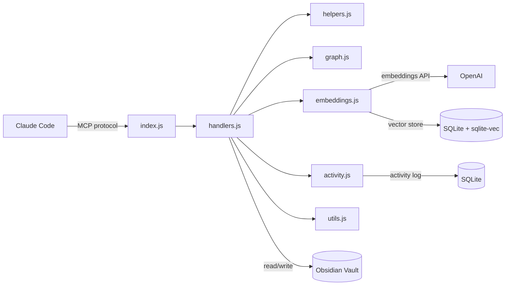

# Obsidian PKM Plugin

[](https://www.npmjs.com/package/obsidian-pkm)
[](https://opensource.org/licenses/MIT)
[](https://nodejs.org/)
[](https://github.com/AdrianV101/obsidian-pkm-plugin/actions/workflows/ci.yml)

A Claude Code plugin that turns your Obsidian vault into persistent, structured memory for AI coding assistants. Provides 19 MCP tools for note creation, semantic search, graph traversal, metadata queries, session memory, and passive knowledge capture — plus hooks and skills for seamless workflow integration. Published on npm as [`obsidian-pkm`](https://www.npmjs.com/package/obsidian-pkm).

## Why

Claude Code has built-in memory, but it's flat text files scoped to individual projects — no structure, no search beyond exact matches, no connections between notes, and no way to query across projects. As knowledge grows, it doesn't scale. This server replaces that with a proper PKM layer: structured notes with enforced metadata, semantic search, a navigable knowledge graph, and cross-project access through a single Obsidian vault.

- **Structured session memory** — Every tool call is logged with timestamps and session IDs, so Claude can recall exactly what was read, written, and searched in previous conversations — not just what was saved to a text file.
- **Structured knowledge creation** — ADRs, research notes, devlogs, and tasks are created from enforced templates with validated frontmatter — not freeform text dumps. Your vault stays consistent and queryable.
- **Semantic discovery** — "Find my notes about caching strategies" works even if you never used the word "caching." Conceptual search surfaces relevant knowledge that keyword search misses.
- **Graph-aware connections** — Claude explores your knowledge graph by following wikilinks, discovering related notes by proximity rather than just content. Link suggestions help weave new notes into your existing web of knowledge.
- **Passive capture** — Decisions, tasks, and research findings are captured in the background without interrupting your coding flow. A session-end sweep catches anything that slipped through.

Without this, knowledge stays fragmented across per-project memory files and chat logs. With it, your AI assistant maintains a unified knowledge base that compounds over time.

https://github.com/user-attachments/assets/58ad9c9b-d987-4728-89e7-33de20b73a38

## Features

### Knowledge Creation & Editing

| Tool | Description |
|------|-------------|
| `vault_write` | Create notes from templates with enforced frontmatter (ADRs, research, devlogs, tasks, etc.) |
| `vault_append` | Add content to notes, with positional insert (after/before heading, end of section) |
| `vault_edit` | Surgical string replacement for precise edits |
| `vault_update_frontmatter` | Atomic YAML frontmatter updates (set, create, remove fields; validates enums by note type) |
| `vault_capture` | Signal a PKM-worthy capture (decision, task, research, bug); background hook creates the note |

### Discovery & Search

| Tool | Description |
|------|-------------|
| `vault_search` | Full-text keyword search across markdown files |
| `vault_semantic_search` | Conceptual similarity search via OpenAI embeddings — finds related notes even with different wording |
| `vault_query` | Query by YAML frontmatter (type, status, tags, dates, custom fields) with sorting |
| `vault_tags` | Discover all tags with per-note counts; folder scoping, glob filters, inline tag parsing |
| `vault_suggest_links` | Suggest relevant notes to link based on content similarity |

### Graph & Connections

| Tool | Description |
|------|-------------|
| `vault_links` | Wikilink analysis (incoming and outgoing links for a note) |
| `vault_neighborhood` | Graph exploration via BFS wikilink traversal — discover related notes by proximity |

### Reading & Navigation

| Tool | Description |
|------|-------------|
| `vault_read` | Read note contents (pagination by heading, tail, chunk, line range; auto-redirects large files) |
| `vault_peek` | Inspect file metadata and structure without reading full content |
| `vault_list` | List files and folders |
| `vault_recent` | Recently modified files |

### Organization & Maintenance

| Tool | Description |
|------|-------------|
| `vault_move` | Move/rename files with automatic wikilink updating across the vault |
| `vault_trash` | Soft-delete to `.trash/` (Obsidian convention), warns about broken incoming links |

### Session Memory

| Tool | Description |
|------|-------------|
| `vault_activity` | Cross-conversation memory — logs every tool call with timestamps and session IDs |

## Prerequisites

- **Node.js >= 20** (Node 18 is EOL; uses native `fetch` and ES modules)
- **An MCP-compatible client** such as [Claude Code](https://claude.ai/code)
- **C++ build tools** for `better-sqlite3` native addon:
  - **macOS**: `xcode-select --install`
  - **Linux**: `sudo apt install build-essential python3` (Debian/Ubuntu) or equivalent
  - **Windows**: Install [Visual Studio Build Tools](https://visualstudio.microsoft.com/visual-cpp-build-tools/) with the "Desktop development with C++" workload

## Quick Start

### 1. Install and Set Up

**Via Claude Code plugin marketplace** (recommended):

```bash
claude plugin marketplace add AdrianV101/obsidian-pkm-plugin
claude plugin install obsidian-pkm
```

Then run the setup skill in Claude Code:

```
/obsidian-pkm:setup
```

The setup skill walks you through vault path, templates, folder structure, semantic search, and Claude Code registration.

**Via npm** (fallback):

```bash
npm install -g obsidian-pkm
obsidian-pkm init
```

The setup wizard walks you through vault path, templates, folder structure, semantic search, and Claude Code registration. Nothing is written until you confirm each step, and you can press Ctrl+C at any time to cancel.

<details>
<summary>Wizard step details</summary>

**Step 1 — Vault path.** Point to an existing Obsidian vault or create a new one. The wizard resolves `~`, `$HOME`, and relative paths automatically. Safety checks prevent using system directories (`/`, `/home`, etc.) as a vault. For existing non-empty directories you can use it as-is, create a subfolder inside it, or wipe it (with triple confirmation). You'll be offered an optional backup before any changes — this creates a timestamped copy next to the vault (e.g. `PKM-backup-2026-03-21T14-30-00/`).

**Step 2 — Note templates.** Copies template files into `<vault>/05-Templates/`. Three options:
- **Full set** — all 13 templates (`adr`, `daily-note`, `devlog`, `fleeting-note`, `literature-note`, `meeting-notes`, `moc`, `note`, `permanent-note`, `project-index`, `research-note`, `task`, `troubleshooting-log`)
- **Minimal** — just `note.md` (a single generic template)
- **Skip** — for users with their own templates

Existing templates are never overwritten.

**Step 3 — PARA folder structure.** Creates 7 top-level folders with `_index.md` stubs:

| Folder | Purpose |
|--------|---------|
| `00-Inbox/` | Quick captures and unsorted notes |
| `01-Projects/` | Active project folders |
| `02-Areas/` | Ongoing areas of responsibility |
| `03-Resources/` | Reference material and reusable knowledge |
| `04-Archive/` | Completed or inactive items |
| `05-Templates/` | Note templates |
| `06-System/` | System configuration and metadata |

Each `_index.md` has `type: moc` frontmatter. Existing folders and index files are skipped.

**Step 4 — OpenAI API key (optional).** Enables `vault_semantic_search` and `vault_suggest_links`. The key is stored only in your Claude Code configuration (`~/.claude.json`) and is used solely for generating text embeddings. You can add this later — see [Enable Semantic Search](#4-enable-semantic-search-optional).

**Step 5 — Claude Code registration.** Registers the MCP server via `claude mcp add -s user`. If `obsidian-pkm` is already registered, you'll be asked whether to overwrite. The exact command is shown for confirmation before running. If the `claude` CLI is not found on PATH, the wizard prints the manual registration command instead.

</details>

Restart Claude Code after setup. The server provides all tools except semantic search out of the box.

**From source:**

```bash
git clone https://github.com/AdrianV101/obsidian-pkm-plugin.git
cd obsidian-pkm-plugin
npm install
node cli.js init
```

You can also run the wizard without a global install: `npx obsidian-pkm init`.

### 2. Manual Registration (alternative)

If you prefer to skip the wizard, register directly with the Claude CLI:

```bash
claude mcp add -s user -e VAULT_PATH=/absolute/path/to/your/vault -- obsidian-pkm npx -y obsidian-pkm@latest
```

For a source install:

```bash
claude mcp add -s user -e VAULT_PATH=/absolute/path/to/your/vault -- obsidian-pkm node /absolute/path/to/cli.js
```

Verify with `claude mcp list` — you should see `obsidian-pkm: ... - Connected`.

### 3. Verify It Works

Open Claude Code and try:

> List the folders in my vault

Claude should call `vault_list` and show your vault's directory structure. If it works, the server is connected and ready.

### 4. Enable Semantic Search (optional)

If you didn't set this up during `init`, add your OpenAI API key by re-registering:

```bash
claude mcp remove obsidian-pkm
claude mcp add -s user \
  -e VAULT_PATH=/absolute/path/to/your/vault \
  -e OPENAI_API_KEY=sk-... \
  -- obsidian-pkm npx -y obsidian-pkm@latest
```

This enables `vault_semantic_search` and `vault_suggest_links`. Uses `text-embedding-3-large` with a SQLite + sqlite-vec index stored at `.obsidian/semantic-index.db`. The index rebuilds automatically — delete the DB file to force a full re-embed.

### 5. Enable PKM Hooks (optional)

The hook system adds automatic context loading at session start and passive knowledge capture during coding. Requires the [Claude CLI](https://docs.anthropic.com/en/docs/claude-cli) installed and authenticated.

Add to your `~/.claude/settings.json` (alongside the `mcpServers` block):

```json
{
  "hooks": {
    "SessionStart": [
      {
        "matcher": "startup|clear|compact",
        "hooks": [
          {
            "type": "command",
            "command": "VAULT_PATH=\"/path/to/your/vault\" node /path/to/obsidian-pkm-plugin/hooks/session-start.js",
            "timeout": 15,
            "statusMessage": "Loading PKM project context..."
          }
        ]
      }
    ],
    "Stop": [
      {
        "hooks": [
          {
            "type": "command",
            "command": "VAULT_PATH=\"/path/to/your/vault\" node /path/to/obsidian-pkm-plugin/hooks/stop-sweep.js",
            "async": true,
            "timeout": 10
          }
        ]
      }
    ],
    "PostToolUse": [
      {
        "matcher": "mcp__obsidian-pkm__vault_capture",
        "hooks": [
          {
            "type": "command",
            "command": "VAULT_PATH=\"/path/to/your/vault\" /path/to/obsidian-pkm-plugin/hooks/capture-handler.sh",
            "async": true,
            "timeout": 10
          }
        ]
      }
    ]
  }
}
```

Replace `/path/to/your/vault` with your Obsidian vault path and `/path/to/obsidian-pkm-plugin` with the path to this repo (or the global npm install location).

| Hook | Event | What it does |
|------|-------|--------------|
| `session-start.js` | SessionStart | Loads project context (index, devlog, active tasks) at session start |
| `stop-sweep.js` | Stop | PKM librarian: creates structured, graph-linked vault notes from the latest exchange |
| `capture-handler.sh` | PostToolUse | Creates structured vault notes when `vault_capture` is called |

See [hooks/README.md](hooks/README.md) for architecture details and troubleshooting.

## Vault Structure

The server works with any Obsidian vault. The included templates assume this layout:

```
Vault/
├── 00-Inbox/
├── 01-Projects/
│   └── ProjectName/
│       ├── _index.md
│       ├── planning/
│       ├── research/
│       └── development/decisions/
├── 02-Areas/
├── 03-Resources/
├── 04-Archive/
├── 05-Templates/          # Note templates loaded by vault_write
└── 06-System/
```

### Templates

`vault_write` loads all `.md` files from `05-Templates/` at startup and enforces frontmatter on every note created. The setup wizard (`obsidian-pkm init`) installs these automatically — or you can copy the files from `templates/` manually.

13 included templates: `adr`, `daily-note`, `devlog`, `fleeting-note`, `literature-note`, `meeting-notes`, `moc`, `note`, `permanent-note`, `project-index`, `research-note`, `task`, `troubleshooting-log`. Add your own templates to `05-Templates/` and they become available to `vault_write` automatically.

### CLAUDE.md for Your Projects

`sample-project/CLAUDE.md` is a template you can drop into any code repository to wire up Claude Code with your vault. It defines context loading, documentation rules, and ADR/devlog conventions.

## Architecture



```
├── index.js          # MCP server, tool definitions, request routing
├── handlers.js       # Tool handler implementations
├── helpers.js        # Pure functions (path security, filtering, templates)
├── graph.js          # Wikilink resolution and BFS graph traversal
├── embeddings.js     # Semantic index (OpenAI embeddings, SQLite + sqlite-vec)
├── activity.js       # Activity log (session tracking, SQLite)
├── utils.js          # Shared utilities (frontmatter parsing, file listing)
├── hooks/            # Claude Code hooks (session context, passive capture)
├── templates/        # Obsidian note templates
└── sample-project/   # Sample CLAUDE.md for your repos
```

All paths passed to tools are relative to vault root. The server includes path security to prevent directory traversal.

## How It Works

**Knowledge creation** is template-based. `vault_write` loads templates from `05-Templates/`, substitutes Templater-compatible variables (`<% tp.date.now("YYYY-MM-DD") %>`, `<% tp.file.title %>`), and validates required frontmatter fields (`type`, `created`, `tags`). This ensures every note in your vault has consistent metadata — making it queryable, sortable, and discoverable from day one. Task notes enforce enum validation on `status` and `priority`; other types accept `project`, `deciders`, `due`, and `source`.

**Knowledge discovery** works at two levels. Keyword search (`vault_search`) finds exact terms. Semantic search embeds notes using OpenAI and finds conceptually related content — so "managing overwhelm" surfaces notes about "cognitive load" even if those exact words never appear together. The semantic index watches for file changes in real-time and syncs across machines via Obsidian Sync.

**Knowledge connections** are maintained through Obsidian's `[[wikilink]]` graph. `vault_neighborhood` traverses links via BFS to discover related notes by proximity, while `vault_suggest_links` recommends connections you haven't made yet. `vault_move` rewrites wikilinks across the vault when you reorganize, and `vault_trash` warns about links that would break.

**Session memory** records every tool call with timestamps and session IDs, so Claude can recall what was read, written, or searched in previous conversations. This turns ephemeral chat sessions into a continuous thread of work.

**Passive capture** uses `vault_capture` to signal that something is worth persisting (a decision, task, research finding, or bug). The tool returns immediately — a PostToolUse hook spawns a background agent that creates the structured vault note. Combined with the Stop hook (which sweeps each session for un-captured knowledge), this keeps your vault up to date without interrupting the coding flow.

**Fuzzy path resolution** lets read-only tools accept short names instead of full vault paths. `vault_read({ path: "devlog" })` resolves to `01-Projects/MyApp/development/devlog.md` automatically (`.md` extension optional). Folder-scoped tools like `vault_search` and `vault_query` accept partial folder names — `folder: "MyApp"` resolves to `01-Projects/MyApp`. Ambiguous matches return an error listing candidates. Write/destructive tools always require exact paths.

## Troubleshooting

**`better-sqlite3` build fails during install**
You need C++ build tools. See [Prerequisites](#prerequisites) for your platform. On Linux, `sudo apt install build-essential python3` usually fixes it.

**Server starts but all tool calls fail with ENOENT**
Your `VAULT_PATH` is wrong or missing. The server validates this at startup and exits with a clear error. Re-register with the correct path: `claude mcp remove obsidian-pkm && claude mcp add -s user -e VAULT_PATH=/correct/path -- obsidian-pkm npx -y obsidian-pkm@latest`

**`vault_write` says "no templates available"**
Run `obsidian-pkm init` to install templates, or copy the `templates/` files from this repo into your vault's `05-Templates/` directory. The server loads templates from there at startup.

**Semantic search not appearing in tool list**
Set `OPENAI_API_KEY` in your MCP server registration. See [Enable Semantic Search](#4-enable-semantic-search-optional). Without it, `vault_semantic_search` and `vault_suggest_links` are hidden entirely.

**Server not showing up in Claude Code after install**
Run `claude mcp list` to check. If `obsidian-pkm` is missing, register it with `claude mcp add` (see [Manual Registration](#2-manual-registration-alternative)). Note: editing `~/.claude/settings.json` directly does **not** register MCP servers — use the CLI.

**Semantic index not updating after file changes**
Check your Node version with `node -v`. The file watcher uses `fs.watch({ recursive: true })` which requires Node.js >= 18.13 on Linux.

## Contributing

Contributions are welcome! Please read [CONTRIBUTING.md](CONTRIBUTING.md) for development setup, code style guidelines, and the pull request process before submitting changes.

See [CHANGELOG.md](CHANGELOG.md) for release history and [SECURITY.md](SECURITY.md) to report vulnerabilities.

## License

MIT

