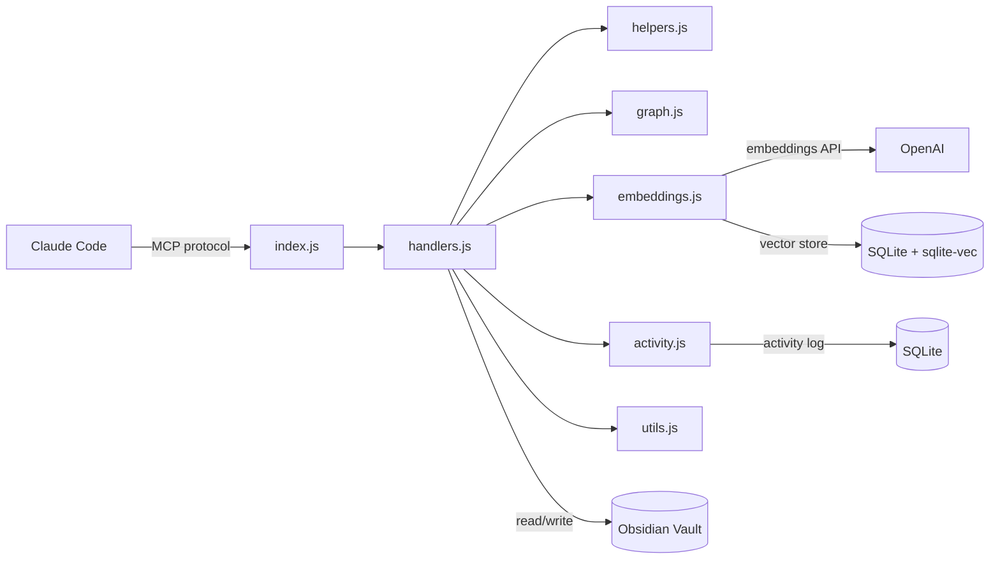

# Obsidian PKM MCP Server

[](https://www.npmjs.com/package/pkm-mcp-server)
[](https://opensource.org/licenses/MIT)
[](https://nodejs.org/)
[](https://github.com/AdrianV101/Obsidian-MCP/actions/workflows/ci.yml)

An MCP (Model Context Protocol) server that gives Claude Code full read/write access to your Obsidian vault. 19 tools for note CRUD, full-text search, semantic search, graph traversal, metadata queries, session activity tracking, and passive knowledge capture. Published on npm as [`pkm-mcp-server`](https://www.npmjs.com/package/pkm-mcp-server).

## Why

Claude Code is powerful for writing code, but it forgets everything between sessions. This server turns your Obsidian vault into persistent, structured memory that Claude can read and write natively.

- **Session continuity** - Claude logs what it did and can pick up where it left off
- **Structured knowledge** - ADRs, research notes, devlogs created from enforced templates, not freeform text dumps
- **Semantic recall** - "find my notes about caching strategies" works even if you never used the word "caching"
- **Graph context** - Claude can explore related notes by following wikilinks, not just keyword matches

Without this, every Claude Code session starts from scratch. With it, your AI assistant has a working memory that compounds over time.

https://github.com/user-attachments/assets/58ad9c9b-d987-4728-89e7-33de20b73a38

## Features

| Tool | Description |
|------|-------------|
| `vault_read` | Read note contents (pagination by heading, tail, chunk, line range; auto-redirects large files to peek data) |
| `vault_peek` | Inspect file metadata and structure without reading full content |
| `vault_write` | Create notes from templates (enforces frontmatter) |
| `vault_append` | Append to notes, with positional insert (after/before heading, end of section) |
| `vault_edit` | Surgical string replacement |
| `vault_search` | Full-text search across markdown files |
| `vault_semantic_search` | Semantic similarity search via OpenAI embeddings |
| `vault_suggest_links` | Suggest relevant notes to link based on content similarity |
| `vault_list` | List files and folders |
| `vault_recent` | Recently modified files |
| `vault_links` | Wikilink analysis (incoming/outgoing) |
| `vault_neighborhood` | Graph exploration via BFS wikilink traversal |
| `vault_query` | Query notes by YAML frontmatter (type, status, tags/tags_any, dates, custom fields, sorting) |
| `vault_tags` | Discover tags with counts; folder scoping, glob filters, inline tag parsing |
| `vault_activity` | Session activity log for cross-conversation memory |
| `vault_trash` | Soft-delete to `.trash/` (Obsidian convention), warns about broken incoming links |
| `vault_move` | Move/rename files with automatic wikilink updating across vault |
| `vault_update_frontmatter` | Atomic YAML frontmatter updates (set, create, remove fields; validates enum fields by note type) |
| `vault_capture` | Signal a PKM-worthy capture (decision, task, research, bug); returns immediately, background hook creates the note |

### Fuzzy Path Resolution

Read-only tools accept short names that resolve to full vault paths:

```javascript
vault_read({ path: "devlog" })
// Resolves to: 01-Projects/Obsidian-MCP/development/devlog.md

vault_read({ path: "devlog.md" })
// Same result — .md extension is optional

vault_links({ path: "alpha" })
// Works on vault_peek, vault_links, vault_neighborhood, vault_suggest_links too
```

Folder-scoped tools accept partial folder names:

```javascript
vault_search({ query: "API design", folder: "Obsidian-MCP" })
// Resolves folder to: 01-Projects/Obsidian-MCP

vault_tags({ folder: "Obsidian-MCP" })
// Works on vault_search, vault_query, vault_tags, vault_recent
```

Ambiguous matches return an error listing candidates. Exact paths always work unchanged.

## Prerequisites

- **Node.js >= 20** (Node 18 is EOL; uses native `fetch` and ES modules)
- **An MCP-compatible client** such as [Claude Code](https://claude.ai/code)
- **C++ build tools** for `better-sqlite3` native addon:
  - **macOS**: `xcode-select --install`
  - **Linux**: `sudo apt install build-essential python3` (Debian/Ubuntu) or equivalent
  - **Windows**: Install [Visual Studio Build Tools](https://visualstudio.microsoft.com/visual-cpp-build-tools/) with the "Desktop development with C++" workload

## Quick Start

### 1. Install and Set Up

**From npm** (recommended):

```bash
npm install -g pkm-mcp-server
pkm-mcp-server init
```

The setup wizard walks you through 5 steps. Nothing is written until you confirm each step, and you can press Ctrl+C at any time to cancel.

**Step 1 — Vault path.** Point to an existing Obsidian vault or create a new one. The wizard resolves `~`, `$HOME`, and relative paths automatically. Safety checks prevent using system directories (`/`, `/home`, etc.) as a vault. For existing non-empty directories you can use it as-is, create a subfolder inside it, or wipe it (with triple confirmation). You'll be offered an optional backup before any changes — this creates a timestamped copy next to the vault (e.g. `PKM-backup-2026-03-21T14-30-00/`).

**Step 2 — Note templates.** Copies template files into `<vault>/05-Templates/`. Three options:
- **Full set** — all 13 templates (`adr`, `daily-note`, `devlog`, `fleeting-note`, `literature-note`, `meeting-notes`, `moc`, `note`, `permanent-note`, `project-index`, `research-note`, `task`, `troubleshooting-log`)
- **Minimal** — just `note.md` (a single generic template)
- **Skip** — for users with their own templates

Existing templates are never overwritten.

**Step 3 — PARA folder structure.** Creates 7 top-level folders with `_index.md` stubs:

| Folder | Purpose |
|--------|---------|
| `00-Inbox/` | Quick captures and unsorted notes |
| `01-Projects/` | Active project folders |
| `02-Areas/` | Ongoing areas of responsibility |
| `03-Resources/` | Reference material and reusable knowledge |
| `04-Archive/` | Completed or inactive items |
| `05-Templates/` | Note templates |
| `06-System/` | System configuration and metadata |

Each `_index.md` has `type: moc` frontmatter. Existing folders and index files are skipped.

**Step 4 — OpenAI API key (optional).** Enables `vault_semantic_search` and `vault_suggest_links`. The key is stored only in your Claude Code configuration (`~/.claude.json`) and is used solely for generating text embeddings. You can add this later — see [Enable Semantic Search](#3-enable-semantic-search-optional).

**Step 5 — Claude Code registration.** Registers the MCP server via `claude mcp add -s user`. If `obsidian-pkm` is already registered, you'll be asked whether to overwrite. The exact command is shown for confirmation before running. If the `claude` CLI is not found on PATH, the wizard prints the manual registration command instead.

Restart Claude Code after setup. The server provides all tools except semantic search out of the box.

**From source:**

```bash
git clone https://github.com/AdrianV101/Obsidian-MCP.git
cd Obsidian-MCP
npm install
node cli.js init
```

You can also run the wizard without a global install: `npx pkm-mcp-server init`.

### 2. Manual Registration (alternative)

If you prefer to skip the wizard, register directly with the Claude CLI:

```bash
claude mcp add -s user -e VAULT_PATH=/absolute/path/to/your/vault -- obsidian-pkm npx -y pkm-mcp-server@latest
```

For a source install:

```bash
claude mcp add -s user -e VAULT_PATH=/absolute/path/to/your/vault -- obsidian-pkm node /absolute/path/to/cli.js
```

Verify with `claude mcp list` — you should see `obsidian-pkm: ... - Connected`.

### 3. Enable Semantic Search (optional)

If you didn't set this up during `init`, add your OpenAI API key by re-registering:

```bash
claude mcp remove obsidian-pkm
claude mcp add -s user \
  -e VAULT_PATH=/absolute/path/to/your/vault \
  -e OPENAI_API_KEY=sk-... \
  -- obsidian-pkm npx -y pkm-mcp-server@latest
```

This enables `vault_semantic_search` and `vault_suggest_links`. Uses `text-embedding-3-large` with a SQLite + sqlite-vec index stored at `.obsidian/semantic-index.db`. The index rebuilds automatically — delete the DB file to force a full re-embed.

### 4. Enable PKM Hooks (optional)

The hook system adds automatic context loading at session start and passive knowledge capture during coding. Requires the [Claude CLI](https://docs.anthropic.com/en/docs/claude-cli) installed and authenticated.

Add to your `~/.claude/settings.json` (alongside the `mcpServers` block):

```json
{
  "hooks": {
    "SessionStart": [
      {
        "matcher": "startup|clear|compact",
        "hooks": [
          {
            "type": "command",
            "command": "VAULT_PATH=\"/path/to/your/vault\" node /path/to/Obsidian-MCP/hooks/session-start.js",
            "timeout": 15,
            "statusMessage": "Loading PKM project context..."
          }
        ]
      }
    ],
    "Stop": [
      {
        "hooks": [
          {
            "type": "command",
            "command": "VAULT_PATH=\"/path/to/your/vault\" node /path/to/Obsidian-MCP/hooks/stop-sweep.js",
            "async": true,
            "timeout": 10
          }
        ]
      }
    ],
    "PostToolUse": [
      {
        "matcher": "mcp__obsidian-pkm__vault_capture",
        "hooks": [
          {
            "type": "command",
            "command": "VAULT_PATH=\"/path/to/your/vault\" /path/to/Obsidian-MCP/hooks/capture-handler.sh",
            "async": true,
            "timeout": 10
          }
        ]
      }
    ]
  }
}
```

Replace `/path/to/your/vault` with your Obsidian vault path and `/path/to/Obsidian-MCP` with the path to this repo (or the global npm install location).

| Hook | Event | What it does |
|------|-------|--------------|
| `session-start.js` | SessionStart | Loads project context (index, devlog, active tasks) at session start |
| `stop-sweep.js` | Stop | PKM librarian: creates structured, graph-linked vault notes from the latest exchange |
| `capture-handler.sh` | PostToolUse | Creates structured vault notes when `vault_capture` is called |

See [hooks/README.md](hooks/README.md) for architecture details and troubleshooting.

## Vault Structure

The server works with any Obsidian vault. The included templates assume this layout:

```
Vault/
├── 00-Inbox/
├── 01-Projects/
│   └── ProjectName/
│       ├── _index.md
│       ├── planning/
│       ├── research/
│       └── development/decisions/
├── 02-Areas/
├── 03-Resources/
├── 04-Archive/
├── 05-Templates/          # Note templates loaded by vault_write
└── 06-System/
```

### Templates

`vault_write` loads all `.md` files from `05-Templates/` at startup and enforces frontmatter on every note created. The setup wizard (`pkm-mcp-server init`) installs these automatically — or you can copy the files from `templates/` manually.

13 included templates: `adr`, `daily-note`, `devlog`, `fleeting-note`, `literature-note`, `meeting-notes`, `moc`, `note`, `permanent-note`, `project-index`, `research-note`, `task`, `troubleshooting-log`. Add your own templates to `05-Templates/` and they become available to `vault_write` automatically.

### CLAUDE.md for Your Projects

`sample-project/CLAUDE.md` is a template you can drop into any code repository to wire up Claude Code with your vault. It defines context loading, documentation rules, and ADR/devlog conventions.

## Architecture



```
├── index.js          # MCP server, tool definitions, request routing
├── handlers.js       # Tool handler implementations
├── helpers.js        # Pure functions (path security, filtering, templates)
├── graph.js          # Wikilink resolution and BFS graph traversal
├── embeddings.js     # Semantic index (OpenAI embeddings, SQLite + sqlite-vec)
├── activity.js       # Activity log (session tracking, SQLite)
├── utils.js          # Shared utilities (frontmatter parsing, file listing)
├── hooks/            # Claude Code hooks (session context, passive capture)
├── templates/        # Obsidian note templates
└── sample-project/   # Sample CLAUDE.md for your repos
```

All paths passed to tools are relative to vault root. The server includes path security to prevent directory traversal.

## How It Works

**Note creation** is template-based. `vault_write` loads templates from `05-Templates/`, substitutes Templater-compatible variables (`<% tp.date.now("YYYY-MM-DD") %>`, `<% tp.file.title %>`), and validates required frontmatter fields (`type`, `created`, `tags`). Optional frontmatter fields — `status`, `priority`, `project`, `deciders`, `due`, `source` — can be set per template type. Task notes enforce enum validation on `status` (pending/active/done/cancelled) and `priority` (low/normal/high/urgent).

**Semantic search** embeds notes on startup and watches for changes via `fs.watch`. Long notes are chunked by `##` headings. The index is a regenerable cache stored in `.obsidian/` so it syncs across machines via Obsidian Sync. The initial sync runs in the background — search is available immediately but may return incomplete results until sync finishes (a progress message is shown).

**Graph exploration** resolves `[[wikilinks]]` to file paths (handling aliases, headings, and ambiguous basenames), then does BFS traversal to return notes grouped by hop distance.

**Activity logging** records every tool call (except `vault_activity` itself) with timestamps and session IDs, enabling Claude to recall what happened in previous conversations.

**Passive capture** uses `vault_capture` to signal that something is worth persisting (a decision, task, research finding, or bug). The tool returns immediately — a PostToolUse hook spawns a background agent that creates the structured vault note. Combined with the Stop hook (which sweeps each session for un-captured decisions and tasks), this keeps the vault up to date without interrupting the coding flow.

## Troubleshooting

**`better-sqlite3` build fails during install**
You need C++ build tools. See [Prerequisites](#prerequisites) for your platform. On Linux, `sudo apt install build-essential python3` usually fixes it.

**Server starts but all tool calls fail with ENOENT**
Your `VAULT_PATH` is wrong or missing. The server validates this at startup and exits with a clear error. Re-register with the correct path: `claude mcp remove obsidian-pkm && claude mcp add -s user -e VAULT_PATH=/correct/path -- obsidian-pkm npx -y pkm-mcp-server@latest`

**`vault_write` says "no templates available"**
Run `pkm-mcp-server init` to install templates, or copy the `templates/` files from this repo into your vault's `05-Templates/` directory. The server loads templates from there at startup.

**Semantic search not appearing in tool list**
Set `OPENAI_API_KEY` in your MCP server registration. See [Enable Semantic Search](#3-enable-semantic-search-optional). Without it, `vault_semantic_search` and `vault_suggest_links` are hidden entirely.

**Server not showing up in Claude Code after install**
Run `claude mcp list` to check. If `obsidian-pkm` is missing, register it with `claude mcp add` (see [Manual Registration](#2-manual-registration-alternative)). Note: editing `~/.claude/settings.json` directly does **not** register MCP servers — use the CLI.

**Semantic index not updating after file changes**
Check your Node version with `node -v`. The file watcher uses `fs.watch({ recursive: true })` which requires Node.js >= 18.13 on Linux.

## Contributing

Contributions are welcome! Please read [CONTRIBUTING.md](CONTRIBUTING.md) for development setup, code style guidelines, and the pull request process before submitting changes.

See [CHANGELOG.md](CHANGELOG.md) for release history and [SECURITY.md](SECURITY.md) to report vulnerabilities.

## License

MIT

