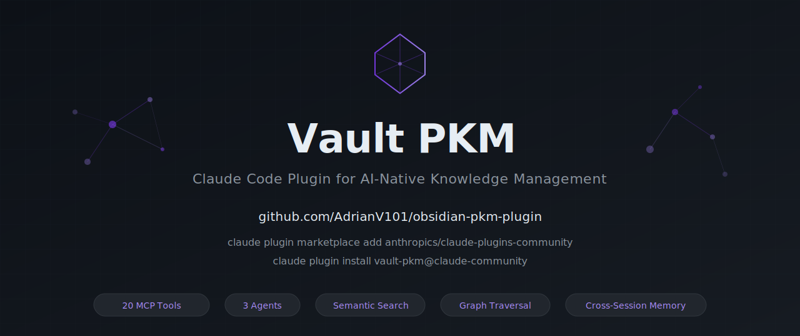
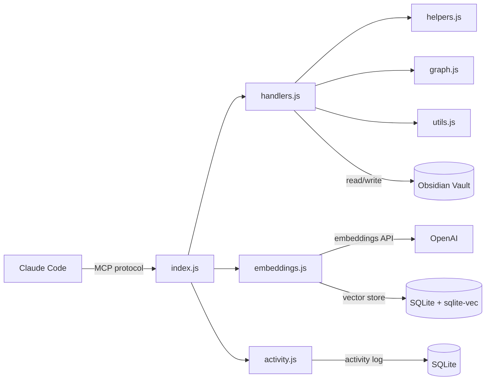

<p align="center">
  
</p>

<p align="center">
  <a href="https://www.npmjs.com/package/obsidian-pkm"></a>
  <a href="https://www.npmjs.com/package/obsidian-pkm"></a>
  <a href="https://github.com/AdrianV101/obsidian-pkm-plugin/stargazers"></a>
  <a href="https://opensource.org/licenses/MIT"></a>
  <a href="https://github.com/AdrianV101/obsidian-pkm-plugin/actions/workflows/ci.yml"></a>
  <a href="https://github.com/AdrianV101/obsidian-pkm-plugin/actions/workflows/ci.yml"></a>
</p>

# Vault PKM

Give Claude persistent, structured memory across conversations using your Obsidian vault. Read, write, search, and navigate your knowledge base — all from within Claude Code.

Under the hood, this Claude Code plugin provides 20 [MCP](https://modelcontextprotocol.io/) (Model Context Protocol) tools for note creation, semantic search, graph traversal, metadata queries, and session memory — plus agents, hooks, and skills for seamless workflow integration. Published on npm as [`obsidian-pkm`](https://www.npmjs.com/package/obsidian-pkm).

> If you find this useful, please [star the repo](https://github.com/AdrianV101/obsidian-pkm-plugin) — it helps others discover the plugin.

[Watch the demo video](https://github.com/user-attachments/assets/564e70d1-9006-4a29-8bed-1ed167bdfe56)

## Why

Claude Code has built-in memory, but it's flat text files scoped to individual projects — no structure, no search beyond exact matches, no connections between notes, and no way to query across projects. As knowledge grows, it doesn't scale. This server replaces that with a proper PKM layer: structured notes with enforced metadata, semantic search, a navigable knowledge graph, and cross-project access through a single Obsidian vault.

- **Structured session memory** — Every tool call is logged with timestamps and session IDs, so Claude can recall exactly what was read, written, and searched in previous conversations — not just what was saved to a text file.
- **Structured knowledge creation** — ADRs, research notes, devlogs, and tasks are created from enforced templates with validated frontmatter — not freeform text dumps. Your vault stays consistent and queryable.
- **Semantic discovery** — "Find my notes about caching strategies" works even if you never used the word "caching." Conceptual search surfaces relevant knowledge that keyword search misses.
- **Graph-aware connections** — Claude explores your knowledge graph by following wikilinks, discovering related notes by proximity rather than just content. Link suggestions help weave new notes into your existing web of knowledge.
- **Knowledge capture** — Decisions, tasks, and research findings are captured by specialized agents in the background without interrupting your coding flow.

Without this, knowledge stays fragmented across per-project memory files and chat logs. With it, your AI assistant maintains a unified knowledge base that compounds over time.

### How It Compares

| | Vault PKM | [remember](https://github.com/Digital-Process-Tools/claude-remember) | Claude built-in memory |
|---|---|---|---|
| **Knowledge base** | Your Obsidian vault (markdown files you own) | Compressed conversation logs (`.remember/` dir) | CLAUDE.md + auto-memory files |
| **Scope** | Cross-project (one vault for everything) | Per-project | Per-project (git-repo scoped) |
| **Semantic search** | OpenAI embeddings | — | — |
| **Graph traversal** | Wikilink BFS, link health audits | — | — |
| **Structured notes** | 13 templates with validated frontmatter | Plain markdown | Plain markdown |
| **Metadata queries** | Filter by type, status, tags, dates, custom fields | — | — |
| **Session memory** | Activity log (every tool call with timestamps) | Tiered daily summaries (Haiku-compressed) | Manual (user writes CLAUDE.md) |
| **Setup effort** | Medium (vault path + optional OpenAI key) | Low (auto hooks, no config) | None (built-in) |
| **MCP tools** | 20 | 0 (hooks-based) | 0 |
| **Agents** | 3 (explorer, capture, auditor) | 0 | 0 |

**remember** is great for lightweight session continuity with minimal setup. **Vault PKM** is for developers who want a structured, searchable, interconnected knowledge base that grows with every project.

## Features

### Knowledge Creation & Editing

| Tool | Description |
|------|-------------|
| `vault_write` | Create notes from templates with enforced frontmatter (ADRs, research, devlogs, tasks, etc.) |
| `vault_append` | Add content to notes, with positional insert (after/before heading, end of section) |
| `vault_edit` | Surgical string replacement for precise edits |
| `vault_update_frontmatter` | Atomic YAML frontmatter updates (set, create, remove fields; validates enums by note type) |

### Discovery & Search

| Tool | Description |
|------|-------------|
| `vault_search` | Full-text keyword search across markdown files |
| `vault_semantic_search` | Conceptual similarity search via OpenAI embeddings — finds related notes even with different wording |
| `vault_query` | Query by YAML frontmatter (type, status, tags, dates, custom fields) with sorting |
| `vault_tags` | Discover all tags with per-note counts; folder scoping, glob filters, inline tag parsing |
| `vault_suggest_links` | Suggest relevant notes to link based on content similarity |

### Graph & Connections

| Tool | Description |
|------|-------------|
| `vault_links` | Wikilink analysis (incoming and outgoing links for a note) |
| `vault_neighborhood` | Graph exploration via BFS wikilink traversal — discover related notes by proximity |
| `vault_add_links` | Add annotated wikilinks to a note's section with deduplication |
| `vault_link_health` | Audit link quality — find orphans, broken links, weak connections, ambiguous links |

### Reading & Navigation

| Tool | Description |
|------|-------------|
| `vault_read` | Read note contents (pagination by heading, tail, chunk, line range; auto-redirects large files) |
| `vault_peek` | Inspect file metadata and structure without reading full content |
| `vault_list` | List files and folders |
| `vault_recent` | Recently modified files |

### Organization & Maintenance

| Tool | Description |
|------|-------------|
| `vault_move` | Move/rename files with automatic wikilink updating across the vault |
| `vault_trash` | Soft-delete to `.trash/` (Obsidian convention), warns about broken incoming links |

### Session Memory

| Tool | Description |
|------|-------------|
| `vault_activity` | Cross-conversation memory — logs every tool call with timestamps and session IDs |

### Agents, Skills & Commands

**Agents** (3) run autonomously in foreground or background:

| Agent | Purpose |
|-------|---------|
| `vault-explorer` | Research existing knowledge before creating notes |
| `pkm-capture` | Devlog entries + knowledge capture after commits and work blocks |
| `link-auditor` | Audit vault link health after bulk note changes |

**Skills** (6) are guided workflows triggered by slash commands:

| Skill | Purpose |
|-------|---------|
| `pkm-write` | Duplicate checking, link discovery, and annotations when creating notes |
| `pkm-explore` | Graph + semantic exploration to map existing knowledge on a topic |
| `pkm-session-end` | Session wrap-up: devlog, undocumented work capture, link health audit |
| `add-task` | Fast task capture from a title with duplicate detection, priority shorthands, and due date |
| `triage-tasks` | Surface open tasks as a numbered list with git completion hints; batch-update via shorthand (e.g. `1,3 done \| 2 active`) |
| `tackle-task` | Work a task end-to-end: read, explore vault context, route to the right workflow tier, close when done |

**Commands** (2) for setup and configuration:

| Command | Purpose |
|---------|---------|
| `/vault-pkm:setup` | Configure vault path, API keys, and permissions |
| `/vault-pkm:init-project` | Connect a code repository to a vault project folder |

## Prerequisites

- **Node.js >= 20** (Node 18 is EOL; uses native `fetch` and ES modules)
- **An MCP-compatible client** such as [Claude Code](https://claude.ai/code)

Prebuilt native binaries are included for Node 20/22 on Linux x64, macOS (x64/arm64), and Windows x64. Most users need nothing else. If the prebuilt fails, you'll need C++ build tools — see [Troubleshooting](#better-sqlite3-build-fails-during-install).

## Quick Start

### 1. Install the Plugin

```bash
claude plugin marketplace add anthropics/claude-plugins-community
claude plugin install vault-pkm@claude-community
```

### 2. Configure

Run the setup skill in Claude Code:

```
/vault-pkm:setup
```

The setup skill walks you through vault path, API keys, tool permissions, and verification. Hooks are registered automatically by the plugin system.

**Important:** Restart your Claude Code session after setup completes so the MCP server picks up the new configuration.

### 3. Scaffold Your Vault (optional)

If you need templates and the PARA folder structure, run the vault scaffolding wizard:

```bash
npx obsidian-pkm init
```

This is separate from the plugin install above — it only sets up your vault's directory structure (PARA folders, note templates). Nothing is written until you confirm each step.

> **Note:** The first `npx` run downloads and compiles native dependencies, which may take 30-60 seconds. Subsequent runs are instant.

<details>
<summary>Scaffold details</summary>

**Step 1 — Vault path.** Point to an existing Obsidian vault or create a new one. The wizard resolves `~`, `$HOME`, and relative paths automatically. Safety checks prevent using system directories (`/`, `/home`, etc.) as a vault. For existing non-empty directories you can use it as-is, create a subfolder inside it, or wipe it (with triple confirmation). You'll be offered an optional backup before any changes.

**Step 2 — Note templates.** Copies template files into `<vault>/05-Templates/`. Three options:
- **Full set** — all 13 templates (`adr`, `daily-note`, `devlog`, `fleeting-note`, `literature-note`, `meeting-notes`, `moc`, `note`, `permanent-note`, `project-index`, `research-note`, `task`, `troubleshooting-log`)
- **Minimal** — just `note.md` (a single generic template)
- **Skip** — for users with their own templates

Existing templates are never overwritten.

**Step 3 — PARA folder structure.** Creates 7 top-level folders with `_index.md` stubs:

| Folder | Purpose |
|--------|---------|
| `00-Inbox/` | Quick captures and unsorted notes |
| `01-Projects/` | Active project folders |
| `02-Areas/` | Ongoing areas of responsibility |
| `03-Resources/` | Reference material and reusable knowledge |
| `04-Archive/` | Completed or inactive items |
| `05-Templates/` | Note templates |
| `06-System/` | System configuration and metadata |

Each `_index.md` has `type: moc` frontmatter. Existing folders and index files are skipped.

</details>

### 4. Verify It Works

Open Claude Code and try:

> List the folders in my vault

Claude should call `vault_list` and show your vault's directory structure. If it works, the server is connected and ready.

### 5. Enable Semantic Search (optional)

Add your OpenAI API key to `~/.claude/settings.json` under the `env` block:

```json
{
  "env": {
    "VAULT_PATH": "/path/to/vault",
    "VAULT_PKM_OPENAI_KEY": "sk-your-key-here"
  }
}
```

Use `VAULT_PKM_OPENAI_KEY` (preferred) to avoid conflicts with project-level OpenAI keys. `OPENAI_API_KEY` is also accepted as a fallback. The previously-documented `OBSIDIAN_PKM_OPENAI_KEY` still works as a deprecated fallback — plan to rename it in your config. Restart Claude Code after saving.

This enables `vault_semantic_search` and `vault_suggest_links`. Uses `text-embedding-3-large` with a SQLite + sqlite-vec index stored at `.obsidian/semantic-index.db`. The index rebuilds automatically — delete the DB file to force a full re-embed.

<details>
<summary><strong>Vault Structure</strong></summary>

The server works with any Obsidian vault. The included templates assume this layout:

```
Vault/
├── 00-Inbox/
├── 01-Projects/
│   └── ProjectName/
│       ├── _index.md
│       ├── planning/
│       ├── research/
│       └── development/decisions/
├── 02-Areas/
├── 03-Resources/
├── 04-Archive/
├── 05-Templates/          # Note templates loaded by vault_write
└── 06-System/
```

### Templates

`vault_write` loads all `.md` files from `05-Templates/` at startup and enforces frontmatter on every note created. Run `npx obsidian-pkm init` to install them automatically, or copy the files from `templates/` manually.

13 included templates: `adr`, `daily-note`, `devlog`, `fleeting-note`, `literature-note`, `meeting-notes`, `moc`, `note`, `permanent-note`, `project-index`, `research-note`, `task`, `troubleshooting-log`. Add your own templates to `05-Templates/` and they become available to `vault_write` automatically.

Task notes enforce `status` (pending, active, done, cancelled) and `priority` (low, normal, high, urgent) enums. All other note types accept any string values for these fields.

### CLAUDE.md for Your Projects

`sample-project/CLAUDE.md` is a template you can drop into any code repository to wire up Claude Code with your vault. It defines context loading, documentation rules, and ADR/devlog conventions.

</details>

<details>
<summary><strong>Architecture</strong></summary>

Module dependencies:



File layout:

```
├── index.js          # MCP server setup, tool registration, lifecycle
├── handlers.js       # Tool handler implementations
├── helpers.js        # Pure functions (path security, filtering, templates, frontmatter)
├── graph.js          # Wikilink resolution and BFS graph traversal
├── embeddings.js     # Semantic index (OpenAI embeddings, SQLite + sqlite-vec)
├── activity.js       # Activity log (session tracking, SQLite)
├── utils.js          # Shared utilities (frontmatter parsing, file listing)
├── cli.js            # CLI entry point (routes `init` subcommand or starts server)
├── init.js           # Vault scaffolding wizard (templates, PARA folders)
├── .claude-plugin/   # Plugin packaging
│   └── plugin.json   # Plugin manifest (identity, components, permissions)
├── hooks/            # Claude Code hooks (context loading, project resolution, session start)
├── agents/           # Specialized agents (vault-explorer, pkm-capture, link-auditor)
├── skills/           # PKM workflow skills (pkm-write, pkm-explore, pkm-session-end, add-task, triage-tasks, tackle-task)
├── commands/         # Slash commands (setup, init-project)
├── templates/        # Obsidian note templates
├── tests/            # Test suite (Node.js built-in test runner)
├── sample-project/   # Sample CLAUDE.md for your repos
└── docs/             # Supplementary documentation
```

`index.js` initializes the semantic index and activity log, then injects them into `createHandlers()`. All paths passed to tools are relative to vault root. The server includes path security to prevent directory traversal.

</details>

## How It Works

**Knowledge creation** is template-based. `vault_write` loads templates from `05-Templates/`, substitutes Templater-compatible variables (`<% tp.date.now("YYYY-MM-DD") %>`, `<% tp.file.title %>`), and validates required frontmatter fields (`type`, `created`, `tags`). This ensures every note in your vault has consistent metadata — making it queryable, sortable, and discoverable from day one. Task notes enforce enum validation on `status` and `priority`; other types accept `project`, `deciders`, `due`, and `source`.

**Knowledge discovery** works at two levels. Keyword search (`vault_search`) finds exact terms. Semantic search embeds notes using OpenAI and finds conceptually related content — so "managing overwhelm" surfaces notes about "cognitive load" even if those exact words never appear together. The semantic index watches for file changes in real-time and syncs across machines via Obsidian Sync.

**Knowledge connections** are maintained through Obsidian's `[[wikilink]]` graph. `vault_neighborhood` traverses links via BFS to discover related notes by proximity, while `vault_suggest_links` recommends connections you haven't made yet. `vault_move` rewrites wikilinks across the vault when you reorganize, and `vault_trash` warns about links that would break.

**Session memory** records every tool call with timestamps and session IDs, so Claude can recall what was read, written, or searched in previous conversations. This turns ephemeral chat sessions into a continuous thread of work.

**Knowledge capture** uses the `pkm-capture` agent to update the project devlog and persist PKM-worthy content from a session (decisions, research findings, tasks, bug root causes) in one pass. It is triggered automatically after git commits via a PreToolUse hook, or can be dispatched manually after significant work blocks. Runs in the background without interrupting the coding flow.

**Fuzzy path resolution** lets read-only tools accept short names instead of full vault paths. `vault_read({ path: "devlog" })` resolves to `01-Projects/MyApp/development/devlog.md` automatically (`.md` extension optional). Folder-scoped tools like `vault_list`, `vault_search`, and `vault_query` accept partial folder names — `folder: "MyApp"` resolves to `01-Projects/MyApp`. Ambiguous matches return an error listing candidates. Write/destructive tools always require exact paths.

## Troubleshooting

**`better-sqlite3` build fails during install**
You need C++ build tools. See [Prerequisites](#prerequisites) for your platform. On Linux, `sudo apt install build-essential python3` usually fixes it.

**Server starts but all tool calls fail with ENOENT**
Your `VAULT_PATH` is wrong or missing. The server validates this at startup and exits with a clear error. Run `/vault-pkm:setup` to reconfigure the vault path.

**`vault_write` says "no templates available"**
Run `npx obsidian-pkm init` to install templates, or copy the `templates/` files from this repo into your vault's `05-Templates/` directory. The server loads templates from there at startup.

**Semantic search not appearing in tool list**
Set `VAULT_PKM_OPENAI_KEY` in `~/.claude/settings.json`. See [Enable Semantic Search](#5-enable-semantic-search-optional). Without it, `vault_semantic_search` and `vault_suggest_links` are hidden entirely.

**Server not showing up in Claude Code after install**
Run `claude mcp list` to check. If `vault-pkm` is missing, reinstall the plugin: `claude plugin install vault-pkm@claude-community`. Then run `/vault-pkm:setup` to configure it.

**Semantic index not updating after file changes**
Check your Node version with `node -v`. The file watcher uses `fs.watch({ recursive: true })` which requires Node.js >= 20.

**Not sure if everything is set up correctly?**
Run `npx obsidian-pkm doctor` for a diagnostic checklist that validates your Node version, vault path, templates, API keys, and native dependencies.

## Contributing

Contributions are welcome! Please read [CONTRIBUTING.md](CONTRIBUTING.md) for development setup, code style guidelines, and the pull request process before submitting changes.

See [CHANGELOG.md](CHANGELOG.md) for release history and [SECURITY.md](SECURITY.md) to report vulnerabilities.

## License

MIT

